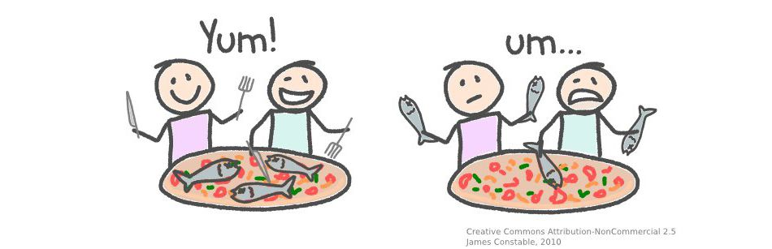
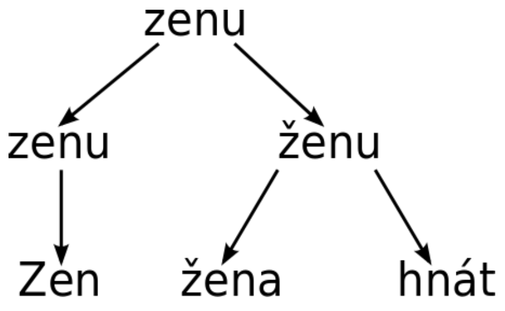

### "Definice"

**Text mining** je sada lingvistických a statistických technik, které dovolují dolovat cenné, doposud neznámé informace z obsáhlých nestrukturovaných, textových databází.

Srovnání s dalšími úkoly datové analýzy:

* **vyhledávání ve strukturovaných datech** (vyhledávání dat): najděte v Brně všechny japonské restaurace, které servírují vegetariánská jídla
```
SELECT * FROM restaurants WHERE city = "Brno" AND type = "Japanese" AND has_veg = true;
```
* **vyhledávání v nestrukturovaných datech** (vyhledávání informací): najděte v Brně japonskou restauraci
```
Do fulltextového vyhledávače (Google) zadáme: "japonská restaurace Brno"
```
* **dolování ve strukturovaných datech** (data mining): ukažte časový trend v počtu návštěv japonských restaurací v Brně
```
SELECT SUM(visits) FROM restaurants WHERE city = "Brno"	AND type = "Japanese" GROUP BY date ORDER BY date;
```
* **dolování v nestrukturovaných datech** (text mining): najděte různé typy otrav jídlem, které jsou spojovány s japonskými restauracemi
```
Projdeme všechny vědecké články, které se zabývají otravami jídlem a vybereme ty, které jsou spojovány
s japonskou kuchyní.
```

Příklady využití text miningu ve skutečném světě:

* analýza pošty a vyhodnocení, jestli se jedná o spam
* analýza zákazníka a personalizovaná reklama
* monitorování veřejného mínění
* automatické rozeznávání dokumentů a jejich zařazování

### Analýza přirozeného jazyka

* **Přirozený jazyk** je základní prostředek lidské komunikace, vznikl přirozeně a dynamicky se vyvíjí. Je subjektivní a emociální, měnící se od člověka k člověku a u každého z nich v čase. Příkladem je čeština, slovenština, angličtina, znakový jazyk.
* **Formální jazyk ** je uměle vytvořený systém, který má nulovou vnitřní neurčitost (jsou exaktní). Tj. každý přesně ví, jaký mají význam. Příkladem je matematika, programovací jazyky.



# Uložení textu

V R máme k dispozici několik datových struktur k uložení a zpracování textu. Klasické textové řetězec jsou vhodé například při práci s popisky grafů, faktory použijeme při modelování kategoriálních proměnných v regresních modelech a při využití pokročilejších technik analýzy textu použijeme také speciální datové struktury. Nejprve se tedy podívejme na krátký přehled datových struktur, které lze použít v R při práci s textem.

### Textové řetězce

Nejobecnější a nejuniverzálnější datová struktura, která může nést text.

```{r}
text <- c("I don’t like sand. It’s coarse and rough and irritating, and it gets everywhere.",
          "No. I am your father.",
          "Use the force, Luke.",
          "These are not the droids your looking for.",
          "Do. Or do not. There is no try.")

text
```

### Faktory

Faktory si můžeme představit jako čísla s popisem. Každá kategorie (level) faktoru je reprezentován číslem (např. 1 = "Male", 2 = "Female"), avšak s faktorem nelze provádět klasické matematické operace. Faktory najdou své využití především v regresních modelech, protože text nemůžeme analyzovat kvantitativně a musíme najít způsob, jak převést slova na čísla.

```{r}
states <- factor(state.region)

attributes(states)

as.numeric(states)
```

### Tidytext

Balíček **tidytext** nabízí další možnosti práce s textem a je plně integrován do ekosystému **tidyverse**.

```{r}
# install.packages("tidytext")
library(tidytext)
library(tidyverse)
```

Nejprve si převeďme původní textový vektor na *tibble* (původně *data_frame*), který uloží každý kaýdý prvek vektoru do samostatného řádku a přidejme si navíc i proměnnou, která označí pořadí daného prvku.

```{r}
text_tbl <- tibble(line=1:5, text=text)

text_tbl
```

Pomocí funkce *unnest_tokens* můžeme nechat R, ať nám daný text rozdělí na jednotlivé elementy (tzv. *tokenizace*). Těmi mohou být jednotlivá slova.

```{r}
text_tt <- text_tbl %>%
  unnest_tokens(word, text)

text_tt
```

Různě n-tice slov, třeba tzv. bigramy.

```{r}
text_tt_bigrams <- text_tbl %>%
  unnest_tokens(ngram, text, token="ngrams", n=2)

text_tt_bigrams
```

Nebo dokonce i celé věty.

```{r}
text_tt_sentences <- text_tbl %>%
  unnest_tokens(sentence, text, token="sentences")

text_tt_sentences
```

### Document-term matice

Jedná se o matici, která popisuje četnost jednotlivých slov (sloupce) v analyzovaných dokumentech (řádky). Jedná se tedy o matici, která má zpravidla několik stovek až tisíc sloupců. Na druhou stranu je většina prvků této matice nulová, takže zabírá méně místa než originální dokumenty.

Document-term matici již můžeme použít jako vstup v některém z algoritmu strojového učení (rozhodovací stromy, neuronové sítě apod.).

Podívejme se, jak vypadá document-term matice pro náš text.

```{r}
# install.packages("tm")
library(tm)

text_dtm <- text_tt %>%
  group_by(line) %>%
  count(word) %>%
  cast_dtm(line, word, n)

inspect(text_dtm)
```

Pro konkrétní matici si můžeme vypsat i jednotlivá slova (sloupce).

```{r}
Terms(text_dtm)
```

### Jazykové korpusy

Jazykový korpus je rozsáhlý soubor textů určitého jazyka. Používají se jednak pro lingvistický výzkum, jednak jako datová základna pro tvorbu slovníků, korektorů, překladačů atd.

```{r}
text_corpus <- VCorpus(VectorSource(text))

summary(text_corpus)

text_corpus[[1]][1]
```

Příklady některých jazykových korpusů:

* [Český korpus](https://www.korpus.cz/)
* [British National Corpus](http://www.natcorp.ox.ac.uk)
* [Common Crawl](http://commoncrawl.org/the-data/get-started/)
* [Wikipedia](https://dumps.wikimedia.org/)

# Práce s textem

### Regulární výrazy

Pomocí jednoduchého řetězce lze nadefinovat celou množinu řetězcům, čehož se využívá nejčastěji při vyhledávání v textu nebo při manipulaci s textem (nahrazování hledaného výrazu za jiný apod.). Znalost regulárních výrazů by měla patřit do výbavy každého datového analytika. Na internetu existuje mnoho nástrojů, které mohou být nápomocné při práci s regulárními výrazy (např. [regexone.com](https://regexone.com/) pro interaktivní výuku regulárních výrazů, [regex101.com](https://regex101.com/) pro testování vlastních regulárních výrazů).

Pro práci s textem a s regulárními výrazy lze používat základní R funkce. Nejčastěji se můžete setkat s funkcemi:

* **paste**: vytváření textových řetězců kombinací textových a numerických proměnných
```{r}
paste0(1:12, c("st", "nd", "rd", rep("th", 9)))
```
* **substr**: vyjmutí nebo nahrazení podřetezce v textovém řetězci
```{r}
substr("abcdef", 2, 4)
```
* **grep**: hledání v textovém řetězci pomocí regulárních výrazů
```{r}
x <- c("https://www.muni.cz/", "Text.s.teckami", "ftp://ftp.xyz.com/")

grep("^(([^:]+)://)?([^:/]+)(:([0-9]+))?(/.*)", x, value=TRUE)
```
* **gsub**: nahrazuje v textu hledaný řetězec za jiný specifikovaný řetezec, lze použít regulární výrazy
```{r}
x <- "Tato  veta ma    moc        mezer."
gsub("\\s{2,}", " ", x)
```
* **strsplit**: rozdělení textového řetězce podle daného oddělovače
```{r}
unlist(strsplit("oddelovac-muze-byt-treba-i-pomlcka", "-"))
```

Novější balíčky nabízejí příjemnější manipulaci s textem a také lepší integraci do hojně využívaného prostředí *tidyverse*. Jedním z nich je *stringr*, který poskytuje mnoho užitečných funkcí, které využijeme v druhé lekci. Pro rychlý přehled funkcí v tomto balíčku doporučuji projít [stringr cheat sheet](https://github.com/rstudio/cheatsheets/blob/master/strings.pdf).

### Stop words

Stop words jsou taková slova, která nenesou žádnou informační hodnotu. Většinou se je snažíme v průběhu analýzy odstranit, jelikož mají velkou četnost a nenesou žádnou cennou informaci. V angličtině se může jednat například o členy (the, a, an), spojky (and, or, because) nebo zájmena (I, you, he, she).

Můžete si definovat vlastní slovník stop words nebo využít nějaký cizí slovník volně dostupný na internetu. My se podíváme na slovník anglických stop words z balíčku *tidytext*, který je dostupný v tibble *stop_words*.


```{r}
stop_words
```

Můžeme se podívat, které slova z našeho původního textu zůstanou po odstranění stop words.

```{r}
text_tt %>%
  anti_join(stop_words, by="word")
```

Slovník stop words z balíčku *tidytext* můžeme obohatit i o vlastní slova jednoduchým způsobem.

```{r}
custom_stop_words <- bind_rows(tibble(word = c("don’t", "it’s"), lexicon = c("custom")), stop_words)

text_tt %>%
  anti_join(custom_stop_words, by="word")
```

### TF-IDF

Určitě vás napadlo, jak správně určit, která slova ještě přidat do stop words a která už ne? Defaultní slovníky navíc mohou obsahovat slova, která ve vašem kontextu mají platný význam (např. is - anglické sloveso vs IS - informační systém).

K zodpovězení těchto otázek nám může pomoci **Inverse document frequency**, která označuje, jak je dané slovo důležité v kolekci dokumentů. Ta se definuje následujícím vztahem:

$$\text{idf(slovo)} = \ln \left( \frac{\#\text{dokumenty}}{\#\text{dokumenty obsahující dané slovo}} \right)$$


Pokud se slovo nachází ve všech dokumentech, potom je váha takového slova 0 ($=\ln (1)$).

Naopak pokud se dané slovo nachází pouze v jednom dokuemntu z mnoha, má toto slovo velkou váhu (např. $\ln (10/1) = 2,3$).

Takto vypočítanou váhu můžeme vynásobit četností daného slova a dostaneme tzv. **term frequency-inverse document frequency**. Ta se definuje následujícím vztahem:

$$\text{tf-idf(slovo)} = \frac{\#\text{slovo v dokumentu}}{\#\text{všechna slova v dokumentu}} \cdot \ln \left( \frac{\#\text{dokumenty}}{\#\text{dokumenty obsahující dané slovo}} \right)$$

Pro ilustraci si můžeme ukázat výpočet *tf-idf* na našem původním textu. Nejprve začneme výpočtem četností pro každé slovo.

```{r}
# vyskyt slov v jednotlivych dokumentech
text_words <- text_tt %>%
  count(line, word, sort=TRUE)

# celkovy vyskyt slov
total_words <- text_words %>% 
  group_by(word) %>% 
  summarise(total=sum(n))

text_words <- left_join(text_words, total_words, by="word")

text_words
```

Pro samotný výpočet *tf-idf* můžeme použít funkci *bind_tf_idf* z balíčku *tidytext*.

```{r}
text_words <- text_words %>%
  bind_tf_idf(word, line, n) %>% 
  arrange(desc(tf_idf))

text_words
```

První slovo *do* se nachází pouze v jednom dokumentu z pěti, dostáváme tedy $\text{idf("do")} = \ln (5/1)= 1,6094379$.

Tento dokument obsahuje celkem 8 slov a slovo *do* se opakuje dvakrát, takže dostáváme $\text{tf("do", D5)} = 1/4$.

Vynásobením těchto dvou čísel dostáváme $\text{tf-idf("do", D5)} = 0,40235948$.

```{r}
text[5]
```

### Stemizace a lemmatizace

**Stemizace** (anglicky *stemming*) je proces, při kterém se slova nahrazují pouze svým základem. Smyslem stemizace je sjednocení slov se stejným význam, ale odlišným tvarem. Výsledný základ nemusí být platným slovem.

**Lemmatizace** (anglicky *lemmatization*) je proces podobný stemizaci, avšak cílem lemmatizace je získat platné slovo. Je náročnější na výpočetní výkon, protože musí procházet velké korpusy a slovníky. Při stemizaci naopak postupujeme podle relativně jednoduchých pravidel.

Například slovo *studies* je při stemizaci normalizováno na základ *studi* (odstranění koncovky *-es*) a slovo *studying* na základ *study* (odstranění koncovky *-ing*). Při lemmatizaci jsou oba tvary převedeny na společné lemma *study*.

Pro ilustraci ještě uveďme příklad věty *the boy's cars are different colors*, která může být normalizovaná na: *the boy car be differ color*.



Ukažme si, jak provést stemizaci v R na našem původním textu. Nejprve je potřeba doinstalovat balíček *SnowballC*. Potom můžeme použít funkci *wordStem*.

```{r}
#install.packages("SnowballC")
library(SnowballC)

text_tt %>% 
  mutate(stem=wordStem(word, "english"))
```

Lemmatizace je náročnější proces, který i vyžaduje pokročilejší techniky. My použijeme externí software [TreeTagger](https://www.cis.uni-muenchen.de/~schmid/tools/TreeTagger/), který má podporu několika jazyků včetně češtiny a slovenštiny. Pro integraci s R je potřeba doinstalovat balíček *koRpus*.

```{r}
# install.packages("koRpus")
library(koRpus)

# install the language support package
# install.koRpus.lang("en")
library(koRpus.lang.en)
```

Samotné nastavení je trochu složitější a pravděpodobně budete muset projít více internetových návodů. Podívejme se, jak dopadne lemmatizace našeho původního textu.

```{r message=FALSE}


set.kRp.env(TT.cmd="manual", TT.options=list(path="C:\\TreeTagger", preset="en"), lang="en")

lemmatization <- treetag(text_tt$word, treetagger="manual", format="obj",
                      TT.tknz=FALSE , lang="en",
                      TT.options=list(path="C:/treeTagger", preset="en"))

lemmatization@tokens
```

Se stemizací se můžete setkat:

* tagovací systémy
* indexování
* SEO (search engine optimization)
* fulltextové vyhledávače


# Analýza sentimentu

Jednou z častých úloh text miningu je analýza sentimentu (nebo také dolování názorů), jejímž cílem je identifikace a extrakce subjektivních informací ze zdrojových textů, nejčastěji různých komentářů a recenzí.

Nejprve je potřeba doinstalovat balíček *textdata*, který obsahuje všechny důležité slovníky.

```{r}
#install.packages("textdata")
library(textdata)
```

K dispozici máme několik slovníků se sentimenty:

* **AFINN** - obsahuje slova a k nim přiřazené skóre od -5 do 5, čím větší číslo, tím pozitivnější slovo
```{r}
get_sentiments("afinn")
```

* **bing** - rozděluje slova do dvou kategorií: positive, negative
```{r}
get_sentiments("bing")
```

* **nrc** - rozděluje slova do kategorií: positive, negative, anger (hněv), anticipation (očekávání), disgust (odpor), fear (strach), joy (radost), sadness (smutek), surprise (překvapení), trust (důvěra)
```{r}
get_sentiments("nrc")
```

* **loughran** - rozděluje slova do kategorií: constraining (omezující), litigious (sporný), negative, positive, superfluous (nadbytečný), uncertainty (nejistota)
```{r}
get_sentiments("loughran")
```

Zkusíme se podívat, jak by byl ohodnocen těmito slovníky nás původní text.

```{r}
text_tt %>% 
  inner_join(get_sentiments("afinn"), by="word")
```

```{r}
text_tt %>% 
  inner_join(get_sentiments("bing"), by="word")
```

```{r}
text_tt %>% 
  inner_join(get_sentiments("nrc"), by="word")
```

```{r}
text_tt %>% 
  inner_join(get_sentiments("loughran"), by="word")
```